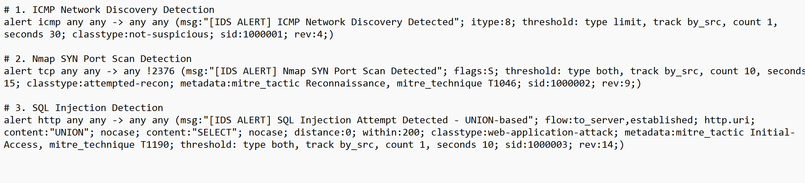
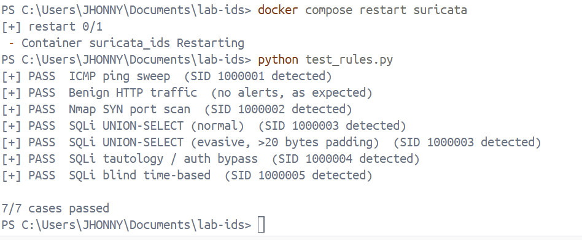
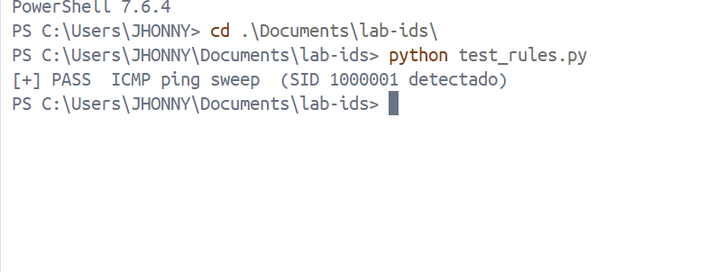
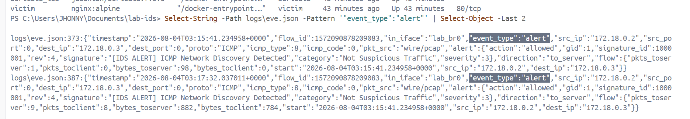

# Suricata IDS: Rule Tuning & Noise Reduction Lab

[](https://suricata.io/)
[](https://www.docker.com/)
[](https://opensource.org/licenses/MIT)
[](https://github.com/JhonnyValdivieso/suricata-ids-rule-tuning/blob/main)

A hands-on Network Intrusion Detection System (NIDS) lab focused on designing custom Suricata detection rules, analyzing raw telemetry, and applying **Alert Tuning** techniques to eliminate false positives and alert fatigue without compromising security coverage — all backed by an **automated test suite that verifies every rule against Suricata's own `eve.json`**.

---

## Executive Summary

High volume of noise and unoptimized signatures in Intrusion Detection Systems leads to **alert fatigue**, masking critical security events inside Security Operations Centers (SOC).

This project builds a fully isolated, containerized environment where five attack vectors — ICMP discovery, TCP SYN scanning, and three classes of Web Application SQL Injection — are launched against custom signatures. Every signature is validated by an automated Python suite that does not merely fire the attack, but **confirms in `eve.json` that the expected alert was generated** (and, for benign traffic, that it was *not*).

Beyond building the rules, the lab produced three documented **detection findings**: a signature-evasion gap in a byte-window rule, a notification blind spot created by alert thresholds, and a verification that forensic logging survives that blind spot. These are the difference between "rules that look right" and "rules I have tested and understand the failure modes of."

## Project Overview: From Alert Fatigue to Precision Tuning

<!-- INFOGRAPHIC PLACEHOLDER -->
<!-- Add your notebook summary infographic here, e.g.: -->


---

## Architecture & Component Overview

The laboratory operates within a lightweight Docker-isolated environment on top of Docker Desktop (Windows/WSL2 backend). Three containers share one **isolated bridge network** (`lab_net`):

```
graph TD
    A[Automated Test Suite<br>test_rules.py] --> ATK[attacker<br>Alpine + nmap, curl, iputils]

    ATK -->|ICMP / SYN scan / SQLi<br>over lab_br0| VIC[victim<br>nginx:alpine]

    C[Suricata NIDS Engine<br>network_mode: host<br>-i lab_br0] -.->|sniffs the whole bridge| ATK
    C -.->|sniffs the whole bridge| VIC

    C -->|Ingestion & Filtering| D[logs/fast.log + eve.json<br>Normalized Alert Stream]
    D --> A
```

### Stack Components

- **Detection Engine:** Suricata NIDS (`jasonish/suricata:7.0.6`) running as a Docker container in `network_mode: host`, sniffing the lab bridge interface `lab_br0`.
- **Attacker:** custom Alpine image (`nmap`, `curl`, `iputils`) with only the `NET_RAW` capability — least privilege for crafting raw SYN packets.
- **Victim:** `nginx:alpine` serving on port 80 — a real HTTP service to attack.
- **Orchestration:** `docker-compose` with volume mounts for rules and logs, and a **pinned bridge name** (see below).
- **Testing Automation:** Python script (`test_rules.py`) that reads `eve.json` from inside the Suricata container and verifies each `signature_id`.

### Why Suricata sits on the host namespace

A Docker bridge behaves like a **switch, not a hub**: a normal member only receives traffic addressed to it. If Suricata were a member of `lab_net`, it would never see the attacker↔victim traffic. Running it with `network_mode: host` places it in the host namespace, where it can observe the entire bridge — the whole "cable."

### Reproducible bridge name (`lab_br0`)

By default Docker names the bridge interface after a random network-ID hash (e.g. `br-1fe765209a84`), and that hash **changes every time the network is recreated** (`docker compose down && up`). Since Suricata is told which interface to sniff with `-i`, a random name makes the lab non-reproducible — it breaks on the next `down`/`up` and on any other machine.

The fix pins the interface name at the network level:

```yaml
networks:
  lab_net:
    driver: bridge
    driver_opts:
      com.docker.network.bridge.name: lab_br0
```

Suricata then always sniffs `-i lab_br0`. Anyone who clones the repo and runs `docker compose up -d` gets an identical, working environment.

> **Known architectural note:** This lab runs on Docker Desktop for Windows. `network_mode: host` exposes the interfaces of the Docker Desktop Linux/WSL2 VM, not the native Windows host NIC. This is sufficient for demonstrating detection logic and tuning methodology, but would not reflect a production deployment on bare-metal Linux.

---

## Signature Engineering (`rules/local.rules`)

Custom signatures live in the local SID range (`>= 1000000`) to avoid collisions with community rulesets, and are mapped to MITRE ATT&CK.

| SID | Detects | Technique | MITRE |
|---|---|---|---|
| 1000001 | ICMP host discovery (ping sweep) | Recon | — |
| 1000002 | Nmap SYN port scan | Recon | T1046 |
| 1000003 | SQL injection — UNION-based | Initial Access | T1190 |
| 1000004 | SQL injection — tautology / auth bypass | Initial Access | T1190 |
| 1000005 | SQL injection — blind time-based | Initial Access | T1190 |

### What the key options do

| Option | Purpose | Essential? |
|---|---|---|
| `itype:8` | Isolates ICMP Echo Requests, filtering out Echo Replies | ✅ Core detection logic |
| `flow:to_server` + `flags:S,12` | Counts only inbound SYNs; `,12` ignores ECN bits (CWR/ECE) so SYNs from modern stacks are not missed | ✅ Robust SYN-scan detection |
| `alert http` + `http.uri` | Uses Suricata's HTTP parser and anchors matching to the normalized URI buffer, not the raw TCP payload | ✅ Prevents false positives from the word "UNION" in unrelated traffic |
| `content:"UNION"` + `content:"SELECT"; distance:0` | Requires both SQLi keywords in order, with **no upper byte bound** | ✅ Catches UNION SQLi regardless of padding (see Finding #1) |
| `pcre:"/'\s*OR\s+/i"` | Confirms the injection marker (quote + OR) for tautologies, avoiding false positives on legitimate `OR` | ✅ Core detection logic |
| `pcre:"/(sleep\|benchmark\|pg_sleep\|waitfor\s+delay)\s*\(/i"` | Matches time-delay function *calls* across DB engines | ✅ Core detection logic |
| `threshold: type both, count N, seconds M` | Requires a minimum event volume **and** caps output to one alert per window | ✅ Separates "legitimate connection" from "scan/attack behavior" |
| `classtype`, `metadata` (MITRE), `rev` | Severity classification, threat-intel mapping, version tracking | ⚪ Documentation — demonstrates SOC-oriented rule design |

---

## Alert Tuning & Iteration Methodology

| Signature | Target Event | Iteration 1 (Initial Problem) | Iteration 2 (First Fix Attempt) | Iteration 3 (Final Solution) |
|---|---|---|---|---|
| SID 1000001 | ICMP Ping | Fired twice per ping (Request + Reply) | `itype:8` isolates the outbound request | ✅ `threshold type limit` → 1 alert per sequence |
| SID 1000002 | Nmap SYN Scan | `flags:S` only + `!2376` port hack to hide daemon noise | Removed the `!2376` hack once capture scope was correct | ✅ `flow:to_server; flags:S,12; threshold both, count 10, seconds 15` |
| SID 1000003 | SQL Injection | `distance:1; within:20` — **evadable** by padding bytes between `UNION` and `SELECT` | Tried `within:200`, then a diagnostic `pcre` — neither was the real cause | ✅ `distance:0` (no `within`) + isolating the threshold blind spot (see Findings) |

---

## Key Findings

The most valuable part of the lab was not the rules themselves, but what automated testing **revealed** about them.

### Finding #1 — `within:20` was an evadable filter

The original UNION rule required `SELECT` within 20 bytes of `UNION` (`distance:1; within:20`). An attacker who pads the gap between the two keywords pushes `SELECT` past the 20-byte window and **evades the rule entirely**.

This was proven, not assumed — the same attack, padded, went from detected to undetected:



The fix (`distance:0`, no `within`) removes the upper bound. This is the classic Achilles heel of signature-based detection — WAFs suffer the same: a signature catches the exact syntax its author anticipated and is bypassed by variations they didn't. The robust answer is to match the *intent* (the pattern family), not one exact string.

### Finding #2 — The `threshold` creates an exploitable blind spot

While testing the SQLi rules, an "evasive" case kept failing — but only when a "normal" case of the **same SID** ran just before it. The cause was not the rule. The `threshold: type both, count 1, seconds 10` means: after one alert for a SID, further alerts are suppressed for 10 seconds. The second attack was detected but silenced.

**Security implication:** thresholds reduce console noise, but create a **notification blind spot**. A second attack of the same SID inside the window — even using a different evasion technique — generates no alert. An attacker who knows the tuning can hide in that window.

### Finding #3 — …but the forensic record survives

A follow-up check confirmed that even when the **alert** is suppressed, Suricata still writes the corresponding `http` event to `eve.json`. The blind spot affects **real-time notification**, not the forensic record — *provided the analysis process reviews raw events, not just alerts.*

> **Operational takeaway:** threshold tuning is a trade-off between noise and coverage. Keep alerting rate-limited for the analyst, but log everything for hunting/forensics, and correlate raw events upstream (SIEM) so a suppressed alert is not a lost detection.

---

## Root Cause Analysis: The Non-Reproducible Bridge

This was the most valuable debugging session of the project, and worth documenting because the root cause was **not** in the rule syntax.

**Symptom:** After building the lab, Suricata ran fine. But after any `docker compose down && up`, `suricata_ids` entered a restart loop and never came back up.

**Diagnostic path:**

1. Read Suricata's logs: `af-packet: eth0: failed to init socket for interface` and `thread "W#01-eth0" failed to start`. The `-i eth0` from an early config was targeting an interface that either had a WSL2-oversized MTU or wasn't where the lab traffic flowed.
2. Listed the real interfaces the host sees (`docker run --rm --net=host alpine ip a`) and found the lab traffic on a bridge named `br-1fe765209a84`, confirmed by two `veth` interfaces with `master br-1fe765209a84`.
3. Pointed Suricata at that bridge — it worked. But after the next `docker compose down && up`, the container broke again.

**Actual root cause:** `docker compose down` destroys the network entirely. Recreating it produces a **new network ID**, and therefore a **new bridge hash**. The old interface name no longer exists, so Suricata sniffs a phantom interface and aborts. The lab only worked on the exact machine, at the exact moment, it was first built.

**Fix:** stop accepting Docker's random name and pin it via `driver_opts`:

```yaml
driver_opts:
  com.docker.network.bridge.name: lab_br0
```

Suricata sniffs `-i lab_br0` permanently. Verified by destroying and recreating the network twice while Suricata stayed `Up`.

**Takeaway:** A NIDS lab's detection logic can be perfectly correct and still break on any machine other than the author's if the infrastructure isn't deterministic. Reproducibility is part of the deliverable.

---

## Validation & Evidence

### 1. Automated Verification Suite

Unlike a script that only launches attacks, `test_rules.py` **verifies detection**: it records the byte offset of `eve.json`, fires the attack, reads only the new events, and asserts the expected `signature_id` appeared. It includes a **negative case** (benign HTTP must not alert) and restarts Suricata per case to clear threshold state for deterministic results.

```
python test_rules.py
```



### 2. The Suite Fails When It Should Fail

A test that always passes is worthless. These controls — a wrong SID, a stopped sensor — confirm the suite actually detects failures:



### 3. High-Fidelity Alert Telemetry

Structured `eve.json` event confirming the sniff interface (`in_iface: lab_br0`), the source/destination, and the matched `signature_id` — one clean, SIEM-ready event per attack:



---

## Repository Structure

```
suricata-ids-rule-tuning/
├── assets/                  # Capturas de pantalla y diagramas de arquitectura
├── attacker/                # Entorno del atacante (Alpine + nmap, curl, iputils)
│   └── Dockerfile
├── config/                  # Configuración del motor NIDS
│   └── suricata.yml
├── logs/                    # Salida de logs del NIDS (eve.json, fast.log) [Gitignored]
├── rules/                   # Firma de detección customizadas
│   └── local.rules
├── .gitignore               # Exclusión de archivos temporales y logs
├── docker-compose.yml       # Orquestación de servicios y red bridge fija (lab_br0)
├── README.md                # Documentación principal del proyecto
└── test_rules.py            # Suite de pruebas de verificación automatizada
```

---

## Key Technical Takeaways

- **Threshold engineering:** Understood the practical difference between `threshold: type limit`, `detection_filter`, and `threshold: type both` — and discovered first-hand the notification blind spot that thresholds create.
- **Signature evasion:** Proved empirically that a `within:` byte-window is evadable by padding, and hardened the rule to match the pattern family instead.
- **Verification over execution:** Built a test suite that reads `eve.json` by byte offset from inside the container, with positive and negative cases, rather than trusting that "the attack ran."
- **Infrastructure reproducibility:** Diagnosed a non-deterministic bridge name down to Docker's network-ID hashing and pinned it, making the lab reproducible for anyone who clones it.
- **Threat Intelligence Mapping:** Tagged signatures with MITRE ATT&CK techniques (T1046, T1190) for SOC-standard triage.

## Known Limitations

- The tautology rule (1000004) requires a quote marker, so quote-less tautologies in numeric fields are not caught. The blind time-based rule (1000005) is signature-based, so obfuscated delay primitives (nested queries, heavy joins) slip through.
- No error-based or out-of-band SQLi coverage; out-of-band detection would require monitoring outbound DNS from the victim.
- The suite's malformed-JSON handling counts and reports dropped lines, but silent line-dropping is itself a log-evasion vector a production pipeline should alert on.
- The SYN rule handles ECN via `flags:S,12`, but the suite does not generate ECN traffic to prove that path.
- The lab runs on Docker Desktop for Windows, so Suricata observes the WSL2 VM's virtual interfaces, not native Windows host traffic.

## Future Work

- A post-processing layer that reviews the raw `http`/`flow` events the rules didn't alert on, to close the threshold blind spot — with a latency chosen by risk. An LLM could correlate these events, treating the logs as attacker-controlled input and verifying conclusions against the raw event.
- Migrate threshold tuning toward a cumulative scoring model instead of binary match/no-match rules.
- Add error-based and out-of-band SQLi coverage.

## License & Legal Disclaimer

### License

This project is licensed under the MIT License - see the [LICENSE](https://github.com/JhonnyValdivieso/suricata-ids-rule-tuning/blob/main/LICENSE) file for details. You are free to use, modify, and distribute this material for educational and defensive security purposes.

### Legal & Educational Disclaimer

> **Notice:** this tool is designed exclusively for authorized network auditing and security hardening assessment. Ensure you have explicit authorization before running audit operations against active enterprise infrastructure. All tests in this lab run against a self-owned, isolated container (victim), never against third-party infrastructure.

## Authors

This project was designed and built jointly by:

- **Jhonny Valdivieso** — [@JhonnyValdivieso](https://github.com/JhonnyValdivieso)
- **Ricardo** — [@Ricardopirlo](https://github.com/Ricardopirlo)

