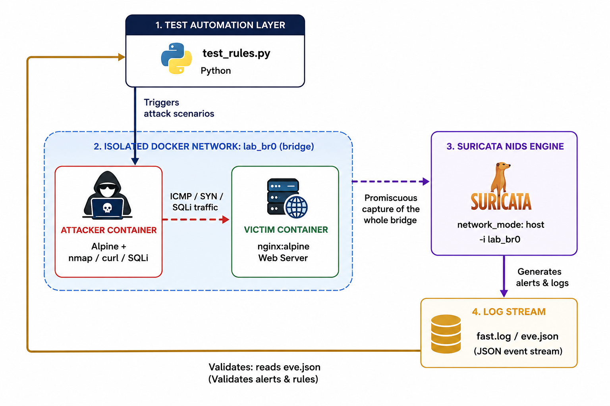
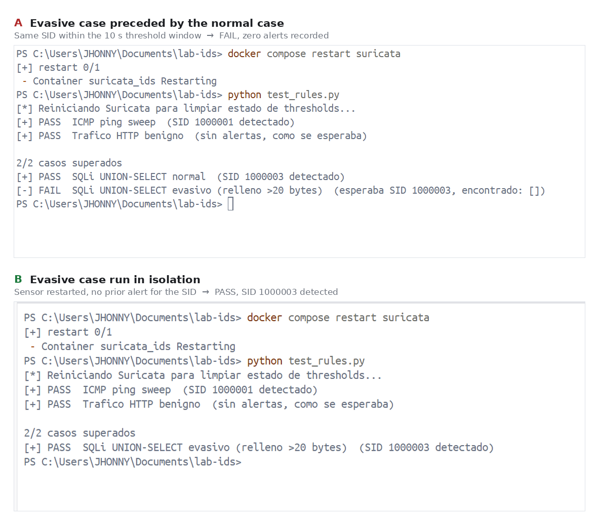

# Suricata IDS: Rule Tuning & Noise Reduction Lab

[](https://suricata.io/)
[](https://www.docker.com/)
[](https://opensource.org/licenses/MIT)
[](https://github.com/JhonnyValdivieso/suricata-ids-rule-tuning)

A hands-on Network Intrusion Detection System (NIDS) lab focused on designing custom Suricata detection rules, analyzing raw telemetry, and applying **Alert Tuning** techniques to eliminate false positives and alert fatigue without compromising security coverage — all backed by an **automated test suite that verifies every rule against Suricata's own `eve.json`**.

---

## Executive Summary

High volume of noise and unoptimized signatures in Intrusion Detection Systems leads to **alert fatigue**, masking critical security events inside Security Operations Centers (SOC).

This project builds a fully isolated, containerized environment where five attack vectors — ICMP discovery, TCP SYN scanning, and three classes of Web Application SQL Injection — are launched against custom signatures. Every signature is validated by an automated Python suite that does not merely fire the attack, but **confirms in `eve.json` that the expected alert was generated** (and, for benign traffic, that it was *not*).

Beyond building the rules, the lab produced three documented **detection findings**: a byte-window bound that makes a signature bypassable by construction, a **measured** notification blind spot created by alert thresholds, and a verification that forensic logging survives that blind spot. These are the difference between "rules that look right" and "rules I have tested and understand the failure modes of."

## Project Overview: From Alert Fatigue to Precision Tuning


---

## Getting Started

**Prerequisites**

- Docker Desktop with the WSL2 backend (Windows) or Docker Engine + Compose v2 (Linux)
- Python 3.8+ on the host — the suite only uses the standard library
- The `docker` CLI available on `PATH` (the suite shells out to `docker exec` and `docker compose`)

**Run the lab**

```bash
git clone https://github.com/JhonnyValdivieso/suricata-ids-rule-tuning.git
cd suricata-ids-rule-tuning

docker compose up -d          # builds the attacker image and starts all three containers
docker compose ps             # suricata_ids, victim and attacker should all be Up

python test_rules.py          # exits 0 only if every case passed
```

The suite must be run from the repository root — it refuses to start otherwise, because it needs `docker-compose.yml` to restart the sensor between cases.

**Tear down**

```bash
docker compose down
```

`logs/` is git-ignored, so `eve.json` and `suricata.log` stay local. Deleting the network is safe: the bridge name is pinned, so the next `up` recreates an identical environment.

---

## Architecture & Component Overview

The laboratory operates within a lightweight Docker-isolated environment on top of Docker Desktop (Windows/WSL2 backend). Three containers make up the lab: attacker and victim sit on one **isolated bridge network** (`lab_net`), while Suricata observes that bridge from the host namespace (see below):



> The diagram labels the isolated segment by its pinned **bridge interface** name, `lab_br0`, which is what Suricata is pointed at. The Compose **network** itself is named `lab_net`; the two names refer to the same segment from different layers.

### Stack Components

- **Detection Engine:** Suricata NIDS (`jasonish/suricata:7.0.6`) running as a Docker container in `network_mode: host`, sniffing the lab bridge interface `lab_br0`.
- **Attacker:** custom Alpine image (`nmap`, `curl`, `iputils`) with only the `NET_RAW` capability — least privilege for crafting raw SYN packets.
- **Victim:** `nginx:alpine` serving on port 80 — a real HTTP service to attack.
- **Orchestration:** `docker-compose` with volume mounts for rules and logs, and a **pinned bridge name** (see below).
- **Testing Automation:** Python script (`test_rules.py`) that reads `eve.json` from inside the Suricata container and verifies each `signature_id`.

### Why Suricata sits on the host namespace

A Docker bridge behaves like a **switch, not a hub**: a normal member only receives traffic addressed to it. If Suricata were a member of `lab_net`, it would never see the attacker↔victim traffic. Running it with `network_mode: host` places it in the host namespace, where it can observe the entire bridge — the whole "cable."

### Reproducible bridge name (`lab_br0`)

By default Docker names the bridge interface after a random network-ID hash (e.g. `br-1fe765209a84`), and that hash **changes every time the network is recreated** (`docker compose down && up`). Since Suricata is told which interface to sniff with `-i`, a random name makes the lab non-reproducible — it breaks on the next `down`/`up` and on any other machine.

The fix pins the interface name at the network level:

```yaml
networks:
  lab_net:
    driver: bridge
    driver_opts:
      com.docker.network.bridge.name: lab_br0
```

Suricata then always sniffs `-i lab_br0`. Anyone who clones the repo and runs `docker compose up -d` gets an identical, working environment.

> **Known architectural note:** This lab runs on Docker Desktop for Windows. `network_mode: host` exposes the interfaces of the Docker Desktop Linux/WSL2 VM, not the native Windows host NIC. This is sufficient for demonstrating detection logic and tuning methodology, but would not reflect a production deployment on bare-metal Linux.

---

## Signature Engineering (`rules/local.rules`)

Custom signatures live in the local SID range (`>= 1000000`) to avoid collisions with community rulesets, and are mapped to MITRE ATT&CK.

| SID | Detects | Technique | MITRE | Threshold |
|---|---|---|---|---|
| 1000001 | ICMP host discovery (ping sweep) | Recon | — | `limit`, 1 / 30 s |
| 1000002 | Nmap SYN port scan | Recon | T1046 | `both`, 10 / 15 s |
| 1000003 | SQL injection — UNION-based | Initial Access | T1190 | `both`, 1 / 10 s |
| 1000004 | SQL injection — tautology / auth bypass | Initial Access | T1190 | none — deliberate |
| 1000005 | SQL injection — blind time-based | Initial Access | T1190 | `both`, 1 / 10 s |

SID 1000004 is the one rule left unthrottled on purpose: a repeated authentication-bypass attempt against a login endpoint is a credential-attack pattern, and suppressing the repeats would hide exactly the signal an analyst needs. Every other rule trades repeat visibility for console quiet.

### What the key options do

| Option | Purpose | Essential? |
|---|---|---|
| `itype:8` | Isolates ICMP Echo Requests, filtering out Echo Replies | ✅ Core detection logic |
| `flow:to_server` + `flags:S,12` | Counts only inbound SYNs; `,12` ignores ECN bits (CWR/ECE) so SYNs from modern stacks are not missed | ✅ Robust SYN-scan detection |
| `alert http` + `http.uri` | Uses Suricata's HTTP parser and anchors matching to the normalized URI buffer, not the raw TCP payload | ✅ Prevents false positives from the word "UNION" in unrelated traffic |
| `content:"UNION"` + `content:"SELECT"; distance:0` | Requires both SQLi keywords in order, with **no upper byte bound** | ✅ Catches UNION SQLi regardless of padding (see Finding #1) |
| `pcre:"/'\s*OR\s+/i"` | Confirms the injection marker (quote + OR) for tautologies, avoiding false positives on legitimate `OR` | ✅ Core detection logic |
| `pcre:"/(sleep\|benchmark\|pg_sleep\|waitfor\s+delay)\s*\(/i"` | Matches time-delay function *calls* across DB engines | ✅ Core detection logic |
| `threshold: type both, count N, seconds M` | Requires a minimum event volume **and** caps output to one alert per window | ✅ Separates "legitimate connection" from "scan/attack behavior" |
| `classtype`, `metadata` (MITRE), `rev` | Severity classification, threat-intel mapping, version tracking | ⚪ Documentation — demonstrates SOC-oriented rule design |

---

## Alert Tuning & Iteration Methodology

| Signature | Target Event | Iteration 1 (Initial Problem) | Iteration 2 (First Fix Attempt) | Iteration 3 (Final Solution) |
|---|---|---|---|---|
| SID 1000001 | ICMP Ping | Fired twice per ping (Request + Reply) | `itype:8` isolates the outbound request | ✅ `threshold type limit` → 1 alert per sequence |
| SID 1000002 | Nmap SYN Scan | `flags:S` only + `!2376` port hack to hide daemon noise | Removed the `!2376` hack once capture scope was correct | ✅ `flow:to_server; flags:S,12; threshold both, count 10, seconds 15` |
| SID 1000003 | SQL Injection | `distance:1; within:20` — a **bounded** byte window | Tried `within:200`, then a diagnostic `pcre` — neither addressed the failure that had been observed | ✅ `distance:0` (no `within`); the observed failure turned out to be **threshold suppression**, not the byte window — see Finding #2 |

The ruleset captured mid-way through that process — three signatures, `!2376` still present, `within:200` still in place — shows what "Iteration 2" actually looked like on disk before the final tuning:


---

## Key Findings

The most valuable part of the lab was not the rules themselves, but what automated testing **revealed** about them — including a hypothesis the testing knocked down.

### Finding #1 — `within:20` bounds the signature, and a bounded signature is bypassable by construction

The first version of the UNION rule was `content:"UNION"; content:"SELECT"; distance:1; within:20`. The `within:20` requires `SELECT` to appear inside the 20 bytes that follow `UNION` **in the normalized `http.uri` buffer** — the buffer the rule actually matches against, not the percent-encoded URL on the wire.

That bound belongs to the signature, not to the attack. Any request that separates the two keywords by more than 20 normalized bytes — padded whitespace, an inline `/**/` comment, a longer expression between them — falls outside the window and never matches, while `UNION` and `SELECT` remain both present, in order, in the same URI. The injection is unchanged; only the spacing is.

The rule was hardened to `distance:0` with no `within`: ordering is still enforced, the upper bound is gone.

> **Scope of this finding, stated plainly:** this is an argument about the matching semantics of `within:`, not a measured result. The suite does carry a padded variant of the UNION case, but its padding does not exceed 20 bytes once the URI is normalized, so it is a coverage case, not an executed bypass. The finding this lab actually *measured* is #2, below — and measuring it is what disproved the original reading of this one.

This is the classic Achilles heel of signature-based detection — WAFs suffer the same: a signature catches the exact syntax its author anticipated and is bypassed by variations they didn't. The robust answer is to match the *intent* (the pattern family), not one exact string.

### Finding #2 — The `threshold` creates an exploitable blind spot

While testing the SQLi rules, the padded case kept failing — but only when the normal case of the **same SID** ran just before it. The first hypothesis was signature evasion. Isolating the variable disproved it.

`threshold: type both, count 1, seconds 10` means: after one alert for a SID, further alerts are suppressed for 10 seconds. The second attack was detected but silenced.



Same rule, same attack, same padding. The only variable is whether an alert for that SID fired within the preceding 10 seconds — and that alone flips the result from FAIL to PASS. This is why the suite now restarts the sensor before every case: without it, one test silently suppresses the next.

**Security implication:** thresholds reduce console noise, but create a **notification blind spot**. A second attack of the same SID inside the window — even using a different evasion technique — generates no alert. An attacker who knows the tuning can hide in that window.

### Finding #3 — …but the forensic record survives

A follow-up check confirmed that even when the **alert** is suppressed, Suricata still writes the corresponding `http` event to `eve.json`. The blind spot affects **real-time notification**, not the forensic record — *provided the analysis process reviews raw events, not just alerts.*

> **Operational takeaway:** threshold tuning is a trade-off between noise and coverage. Keep alerting rate-limited for the analyst, but log everything for hunting/forensics, and correlate raw events upstream (SIEM) so a suppressed alert is not a lost detection.

---

## Root Cause Analysis: The Non-Reproducible Bridge

This was the most valuable debugging session of the project, and worth documenting because the root cause was **not** in the rule syntax.

**Symptom:** After building the lab, Suricata ran fine. But after any `docker compose down && up`, `suricata_ids` entered a restart loop and never came back up.

**Diagnostic path:**

1. Read Suricata's logs: `af-packet: eth0: failed to init socket for interface` and `thread "W#01-eth0" failed to start`. The `-i eth0` from an early config was targeting an interface that either had a WSL2-oversized MTU or wasn't where the lab traffic flowed.
2. Listed the real interfaces the host sees (`docker run --rm --net=host alpine ip a`) and found the lab traffic on a bridge named `br-1fe765209a84`, confirmed by two `veth` interfaces with `master br-1fe765209a84`.
3. Pointed Suricata at that bridge — it worked. But after the next `docker compose down && up`, the container broke again.

**Actual root cause:** `docker compose down` destroys the network entirely. Recreating it produces a **new network ID**, and therefore a **new bridge hash**. The old interface name no longer exists, so Suricata sniffs a phantom interface and aborts. The lab only worked on the exact machine, at the exact moment, it was first built.

**Fix:** stop accepting Docker's random name and pin it via `driver_opts`:

```yaml
driver_opts:
  com.docker.network.bridge.name: lab_br0
```

Suricata sniffs `-i lab_br0` permanently. Verified by destroying and recreating the network twice while Suricata stayed `Up`.

**Takeaway:** A NIDS lab's detection logic can be perfectly correct and still break on any machine other than the author's if the infrastructure isn't deterministic. Reproducibility is part of the deliverable.

---

## Validation & Evidence

> **Note on the screenshots.** They document the lab as it was run, and the suite kept evolving afterwards: some captures come from an earlier Spanish-language iteration, and rule `msg`/`rev` strings have since been edited. Where a capture differs from the current code, that is called out below rather than hidden — the evolution *is* part of the finding.

### 1. Automated Verification Suite

Unlike a script that only launches attacks, `test_rules.py` **verifies detection**: it records the byte offset of `eve.json`, fires the attack, reads only the new events, and asserts the expected `signature_id` appeared. It includes a **negative case** (benign HTTP must not alert), and before every case it restarts Suricata and waits for the engine to report it is capturing — which both clears threshold state (Finding #2) and aborts the case if any rule failed to load.

```
python test_rules.py        # exits 0 only if every case passed
```


Seven cases: five attack vectors, one padded variant, one benign control. The capture predates two later additions — the expanded summary line (`0 failed, 0 not verified`) and the `[i] NOTE` emitted when one request trips several signatures.

### 2. The Suite Fails When It Should Fail — and Why It Grew a Third Outcome

A test that always passes is worthless. These controls injected two failure modes deliberately: a wrong expected SID, and a stopped sensor.


The wrong-SID control behaves correctly: expected `1000999`, saw `1000001`, reported `FAIL` — and by printing what it *did* see, it distinguishes "nothing fired" from "the wrong rule fired."

The stopped-sensor control is the interesting one. It also reported `FAIL` — and that is **wrong**. A dead sensor did not prove the rule failed; it proved nothing at all. A suite with only two outcomes is forced to file "I could not check" under "the rule is broken," which erodes trust in every red line it prints.

That control is why the suite now has **three** outcomes. `docker_exec` propagates an `ok` flag from every read, and an unreachable container, a truncated `eve.json` or an attack command that never ran are reported as `ERROR`, not `FAIL`:

```python
found, sids, dropped, ok = wait_for_alert(offset, expected_sid)
if not ok:
    return report(ERROR, name, "eve.json unreadable or truncated mid-test")
```

The screenshot documents the failure mode; the code documents the fix.

### 3. High-Fidelity Alert Telemetry

Structured `eve.json` events confirming the sniff interface (`in_iface: lab_br0`), the source/destination, and the matched `signature_id` — clean, SIEM-ready records with no payload noise to wade through:


Two ICMP alerts from two separate ping sequences, each collapsed to a single event by `threshold type limit` rather than one alert per echo request. The `signature` text and `rev` shown here are from an earlier revision of SID 1000001; the current rule message and `rev` are in `rules/local.rules`.

---

## Repository Structure

```
suricata-ids-rule-tuning/
├── assets/
│   ├── architecture.png
│   ├── IDS_Tuning_Process.png
│   ├── infrastructure.png
│   ├── rules-iteration-2.png
│   ├── test-negative-controls.png
│   ├── test-suite-passing.png
│   └── threshold-blind-spot.png
├── attacker/
│   └── Dockerfile
├── rules/
│   └── local.rules
├── logs/
│   └── .gitkeep
├── .gitattributes
├── .gitignore
├── LICENSE
├── docker-compose.yml
├── test_rules.py
└── README.md
```

---

## Key Technical Takeaways

- **Threshold engineering:** Understood the practical difference between `threshold: type limit`, `detection_filter`, and `threshold: type both` — and measured first-hand the notification blind spot that thresholds create.
- **Isolating the variable:** The padded SQLi case failing looked like signature evasion. Running it alone, with nothing else changed, produced a `PASS` — which killed that hypothesis and exposed the real cause. Testing is what stopped a plausible wrong conclusion from reaching this README as a finding.
- **Signature bounds:** Reasoned through why a `within:` byte window is bypassable by construction, and hardened the rule to match the pattern family instead — while keeping that argument clearly separate from what was measured.
- **Verification over execution:** Built a test suite that reads `eve.json` by byte offset from inside the container, with positive and negative cases, rather than trusting that "the attack ran."
- **Unverifiable is not the same as failing:** The suite distinguishes `PASS` / `FAIL` / `ERROR`, so a dead sensor, an attack command that never ran, or a truncated log is never reported as a broken rule — a distinction added *because* a control run exposed its absence.
- **Infrastructure reproducibility:** Diagnosed a non-deterministic bridge name down to Docker's network-ID hashing and pinned it, making the lab reproducible for anyone who clones it.
- **Threat Intelligence Mapping:** Tagged signatures with MITRE ATT&CK techniques (T1046, T1190) for SOC-standard triage.

## Known Limitations

- **All three SQLi rules match the normalized `http.uri` buffer only.** Injection delivered in a POST body is not inspected and will not alert — which includes the most common real-world shape of the auth-bypass case (a login form). Covering it means adding `http.request_body` and raising `request-body-limit` in `suricata.yaml`; it is out of scope here but it is the single biggest coverage gap in the ruleset.
- **The padded UNION case exercises coverage, not evasion.** After URI normalization its padding stays inside the 20-byte window the original rule used. Demonstrating the Finding #1 bypass empirically would require padding above that bound, run in isolation so threshold suppression cannot again be mistaken for a rule failure.
- The tautology rule (1000004) requires a quote marker, so quote-less tautologies in numeric fields are not caught. The blind time-based rule (1000005) is signature-based, so obfuscated delay primitives (nested queries, heavy joins) slip through.
- Signature overlap is documented, not eliminated: a payload such as `1' OR SLEEP(5)--` legitimately trips both 1000004 and 1000005, producing two alerts for one request. The suite reports the overlap rather than hiding it.
- SID 1000004 carries no threshold by design, so a sustained credential-stuffing run against a login endpoint will produce one alert per request. That is the intended trade-off, but it is a noise source a production deployment would need to bound.
- The attacker image pins its Alpine base but not the individual package versions, so images built at different times may not be byte-identical.
- No error-based or out-of-band SQLi coverage; out-of-band detection would require monitoring outbound DNS from the victim.
- The suite's malformed-JSON handling counts and reports dropped lines, but silent line-dropping is itself a log-evasion vector a production pipeline should alert on.
- The SYN rule handles ECN via `flags:S,12`, but the suite does not generate ECN traffic to prove that path.
- The lab runs on Docker Desktop for Windows, so Suricata observes the WSL2 VM's virtual interfaces, not native Windows host traffic.

## Future Work

- Close Finding #1 empirically: add a padded case above the byte bound, run in isolation, against both the bounded and unbounded rule.
- A post-processing layer that reviews the raw `http`/`flow` events the rules didn't alert on, to close the threshold blind spot — with a latency chosen by risk. An LLM could correlate these events, treating the logs as attacker-controlled input and verifying conclusions against the raw event.
- Migrate threshold tuning toward a cumulative scoring model instead of binary match/no-match rules.
- Add error-based and out-of-band SQLi coverage.

## License & Legal Disclaimer

### License

This project is licensed under the MIT License - see the [LICENSE](https://github.com/JhonnyValdivieso/suricata-ids-rule-tuning/blob/main/LICENSE) file for details. You are free to use, modify, and distribute this material for educational and defensive security purposes.

### Legal & Educational Disclaimer

> **Notice:** this tool is designed exclusively for authorized network auditing and security hardening assessment. Ensure you have explicit authorization before running audit operations against active enterprise infrastructure. All tests in this lab run against a self-owned, isolated container (victim), never against third-party infrastructure.

## Authors

This project was designed and built jointly by:

- **Jhonny Valdivieso** — [@JhonnyValdivieso](https://github.com/JhonnyValdivieso)
- **Ricardo Vargas** — [@Ricardopirlo](https://github.com/Ricardopirlo)
