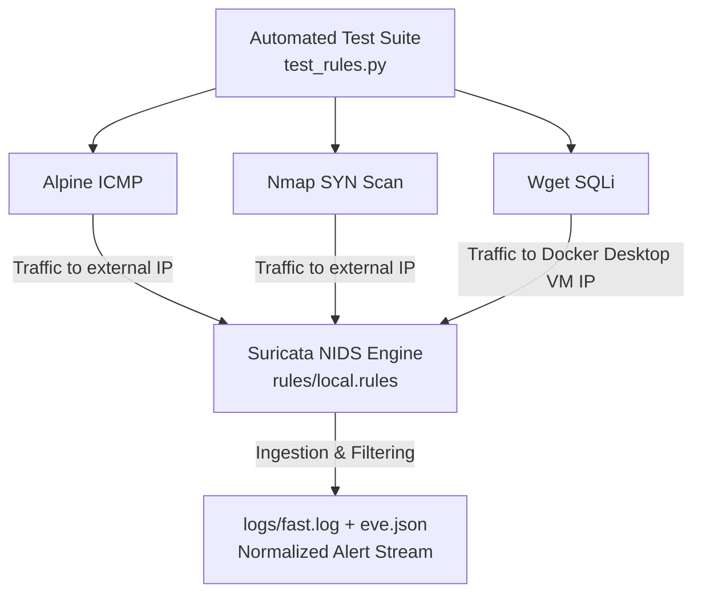

# 🛡️ Suricata IDS: Rule Tuning & Noise Reduction Lab

[](https://suricata.io/)
[](https://www.docker.com/)
[](https://opensource.org/licenses/MIT)
[]()

A hands-on Network Intrusion Detection System (NIDS) lab focused on designing custom Suricata detection rules, analyzing raw telemetry, and applying **Alert Tuning** techniques to eliminate false positives and alert fatigue without compromising security coverage.

---

## 📌 Executive Summary

High volume of noise and unoptimized signatures in Intrusion Detection Systems leads to **alert fatigue**, masking critical security events inside Security Operations Centers (SOC).

This project simulates a controlled containerized environment where network attack vectors (ICMP discovery, TCP SYN scanning, and Web Application SQL Injection) are launched against custom signatures. Through **three full iterations of tuning** — including a real production-style debugging session covering rule logic, payload encoding, and network interface capture scope — the log volume was reduced from redundant, misleading, or entirely missing alerts to **exact, high-fidelity, one-event-per-attack detections**.

---

## 🏗️ Architecture & Component Overview

The laboratory operates within a lightweight Docker-isolated environment on top of Docker Desktop (Windows/WSL2 backend):



### Stack Components:
* **Detection Engine:** Suricata NIDS running as a Docker container, capturing on **both** `eth0` and `lo` (see Root Cause Analysis below for why both are required).
* **Orchestration:** `docker-compose` mapping volume mounts for rules and logs.
* **Testing Automation:** Custom Python script (`test_rules.py`) executing controlled `docker run` triggers against network interfaces.
* **Log Inspection:** PowerShell real-time log monitoring (`Get-Content -Wait`), and `eve.json` for structured, SIEM-ready event data.

> **Known architectural limitation:** This lab runs on Docker Desktop for Windows. `network_mode: host` does **not** expose the real Windows host NIC — it exposes the interface of the Docker Desktop Linux/WSL2 VM. Suricata is therefore monitoring traffic on that VM's virtual interface, not native Windows host traffic. This is sufficient for demonstrating detection logic and tuning methodology, but would not reflect a production deployment on bare-metal Linux.

---

## 📝 Signature Engineering (`rules/local.rules`)

```snort
# 1. ICMP Network Discovery Detection
alert icmp any any -> any any (msg:"[IDS ALERT] ICMP Network Discovery Detected"; itype:8; threshold: type limit, track by_src, count 1, seconds 30; classtype:not-suspicious; sid:1000001; rev:4;)

# 2. Nmap SYN Port Scan Detection
alert tcp any any -> any !2376 (msg:"[IDS ALERT] Nmap SYN Port Scan Detected"; flags:S; threshold: type both, track by_src, count 10, seconds 15; classtype:attempted-recon; metadata:mitre_tactic Reconnaissance, mitre_technique T1046; sid:1000002; rev:9;)

# 3. SQL Injection Attack Detection (HTTP-anchored, UNION-based)
alert http any any -> any any (msg:"[IDS ALERT] SQL Injection Attempt Detected - UNION-based"; flow:to_server,established; http.uri; content:"UNION"; nocase; content:"SELECT"; nocase; distance:1; within:20; classtype:web-application-attack; metadata:mitre_tactic Initial-Access, mitre_technique T1190; threshold: type both, track by_src, count 1, seconds 10; sid:1000003; rev:13;)
```
### What each option does

| Option | Purpose | Essential? |
|---|---|---|
| `itype:8` | Isolates outbound ICMP Echo Requests, filtering out Echo Replies | ✅ Core detection logic |
| `flags:S` | Matches only TCP SYN packets (connection attempts) | ✅ Core detection logic |
| `alert http` + `http.uri` | Uses Suricata's HTTP parser and anchors content matching to the URI buffer specifically — not the raw TCP payload | ✅ Prevents false positives from unrelated traffic containing the word "UNION" |
| `content:"UNION"` + `content:"SELECT"` with `distance:1; within:20;` | Requires both SQLi indicators, in order, within a small byte window (accounting for the decoded space between them) | ✅ Prevents single-keyword false positives |
| `threshold: type both, count N, seconds M` | Requires a minimum volume of events **and** limits output to one alert per window | ✅ Critical — this is what separates "any legitimate connection" from "actual scan/attack behavior" |
| `classtype`, `metadata` (MITRE ATT&CK), `rev` | Severity classification, threat-intel mapping, version tracking | ⚪ Cosmetic/documentation — does not affect detection logic, but demonstrates SOC-oriented rule design |

---
## ⚡ Alert Tuning & Noise Reduction Methodology

| Signature ID | Target Event | Iteration 1 (Initial Problem) | Iteration 2 (First Fix Attempt) | Iteration 3 (Final Solution) |
|---|---|---|---|---|
| SID: 1000001 | ICMP Ping | Fired twice per ping (Request + Reply) | `itype:8` isolates the outbound request | ✅ 1 alert per ping sequence |
| SID: 1000002 | Nmap SYN Scan | `threshold: type limit, count 1` fired on **any** new TCP connection, not just scans | `detection_filter, count 10, seconds 3` required real scan volume, but fired once **per port** scanned (~12 duplicate alerts) — window too short for a full scan | ✅ `threshold: type both, count 10, seconds 15` requires real volume **and** caps output to 1 alert per window |
| SID: 1000003 | SQL Injection | `content:"UNION"` matched anywhere in the raw payload — high false-positive risk, no HTTP anchoring | Anchored to `http.uri` with `distance:0` — silently never matched, because the decoded URI has a real space character between `UNION` and `SELECT` | ✅ `distance:1; within:20;` correctly accounts for the space, matching the real `UNION SELECT` pattern |

---
## 🔍 Root Cause Analysis: Why the SQLi Rule Stayed Silent (Loopback vs. Interface Capture)

This was the most valuable debugging session of the project, and worth documenting in detail because the root cause was **not** in the rule syntax.

**Symptom:** ICMP and Nmap alerts fired correctly on every run. The SQL Injection alert fired zero times, with no errors anywhere — not in Suricata's logs, not in the rule loading output, not in `eve.json`.

**Diagnostic path:**
1. Confirmed `web_target` (nginx) was up and responding to plain HTTP requests — ruled out "nginx is down."
2. Confirmed the test payload was reaching nginx (`200`/`404` responses came back) — ruled out "the packet never left the container."
3. Searched `eve.json` for any HTTP event matching the test URL — **found nothing at all**, which ruled out a rule-syntax problem (if Suricata had seen and parsed the HTTP request, it would appear here even without an alert).
4. This pointed to a capture-scope problem: Suricata was started with `-i eth0` only.

**Actual root cause:** Both the SQLi test traffic (`127.0.0.1`, then later the host's own IP `192.168.65.3`) and the destination were on the **same machine**. Linux delivers same-host traffic through the **loopback interface (`lo`)** at the kernel level — it never traverses `eth0`, regardless of whether the destination is `127.0.0.1` or the machine's own real IP. Since Suricata was only capturing on `eth0`, this traffic was structurally invisible to it — not filtered, not dropped, simply never seen.

ICMP and Nmap traffic, by contrast, targeted an external IP (`1.1.1.1`), which genuinely traverses `eth0`, so those rules worked from the start — masking the fact that the capture interface itself was incomplete.

**Fix:** Suricata needs to capture on both interfaces:
```yaml
command: -i eth0 -i lo -S /var/lib/suricata/rules/local.rules
```
(An initial attempt using `-i any` failed, because Suricata's default `af-packet` capture mode requires real interface names — `any` is not a valid `af-packet` device, unlike tools such as `tcpdump` which handle it as a special pseudo-interface.)

**Takeaway:** A NIDS lab's detection logic can be perfectly correct and still silently miss traffic if the capture scope doesn't match where the traffic actually flows. This is a common and easy-to-miss issue specifically in single-host lab environments, where "attacker" and "victim" containers share the same network namespace.

---

## 🧪 Validation & Evidence

### 1. Automated Execution Suite
 
```bash
python test_rules.py
```
 
> **Note:** the SQL Injection test targets the Docker Desktop VM's `eth0` IP directly.
 
### 2. High-Fidelity Alert Telemetry
 
Final `fast.log` output — one alert per attack vector, no duplicate noise:
 
```
08/02/2026-19:15:02.113182  [**] [1:1000001:4] [IDS ALERT] ICMP Network Discovery Detected [**] [Classification: Not Suspicious Traffic] [Priority: 3] {ICMP} 192.168.65.3:8 -> 1.1.1.1:0
08/02/2026-19:15:07.305996  [**] [1:1000002:9] [IDS ALERT] Nmap SYN Port Scan Detected [**] [Classification: Attempted Information Leak] [Priority: 2] {TCP} 192.168.65.3:64293 -> 1.1.1.1:65
08/02/2026-19:15:16.069929  [**] [1:1000003:13] [IDS ALERT] SQL Injection Attempt Detected - UNION-based [**] [Classification: Web Application Attack] [Priority: 1] {TCP} 192.168.65.3:41106 -> 192.168.65.3:80
```
 
---
 
## 📁 Repository Structure
 
```
suricata-ids-rule-tuning/
├── docker-compose.yml      # Suricata + web_target container orchestration
├── rules/
│   └── local.rules         # Custom tuned Suricata signatures (rev 4/9/13)
├── logs/
│   └── fast.log             # NIDS alert log output (gitignored)
├── test_rules.py             # Automated attack simulation script
└── README.md                # Project documentation
```
 
---
## 🧠 Key Technical Takeaways

- **Threshold engineering:** Understood the practical difference between `threshold: type limit`, `detection_filter`, and `threshold: type both` — and why only the last one correctly combines "require real attack volume" with "suppress duplicate noise."
- **HTTP-layer anchoring:** Moved from raw TCP payload matching to `http.uri`-anchored, multi-token detection to eliminate false positives in the SQLi signature.
- **Capture-scope debugging:** Diagnosed a silent detection failure down to the network-interface layer (loopback vs. `eth0`), rather than assuming the problem was rule syntax.
- **SOC Efficiency:** Demonstrated how proper thresholding directly improves SIEM ingestion costs and analyst response speed.
- **Threat Intelligence Mapping:** Tagged custom signatures with MITRE ATT&CK techniques (T1046, T1190) for SOC-standard triage.

## ⚠️ Known Limitations

- Detection of "many SYNs from one source" does not distinguish a single-port repeated connection attempt from a genuine multi-port scan; true multi-port scan correlation would require aggregating `eve.json` events by `src_ip` + unique `dest_port` count in a SIEM, rather than relying on the Suricata rule alone.
- The lab runs on Docker Desktop for Windows, which means Suricata observes the Docker Desktop VM's virtual interfaces, not native Windows host traffic.
- `test_rules.py` currently hardcodes the target IP; it should ideally resolve it dynamically via `docker exec suricata_ids ip addr show eth0`.

## License & Legal Disclaimer

### License
This project is licensed under the MIT License - see the [LICENSE](LICENSE) file for details. You are free to use, modify, and distribute this material for educational and defensive security purposes.

### Legal & Educational Disclaimer
> **Notice:** This tool is designed for authorized network auditing and security hardening assessment purposes only. Ensure you have explicit authorization before running audit operations against active enterprise infrastructure.

